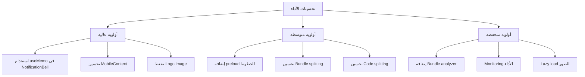
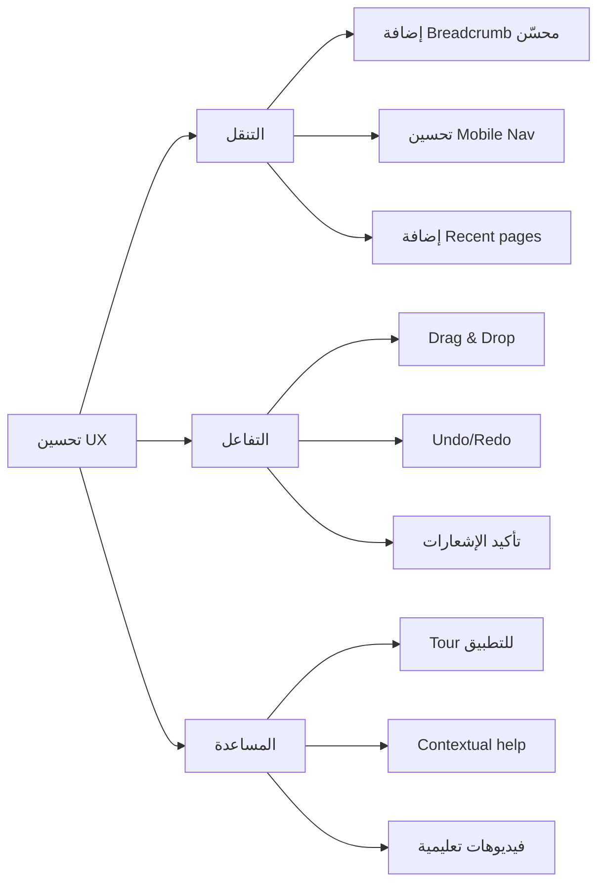

# تقرير المراجعة الشاملة للتطبيق Trade Navigator

## الملخص التنفيذي

تم إجراء مراجعة شاملة ومعمقة للتطبيق Trade Navigator (مساعد التجارة الصيني). التطبيق هو نظام إدارة متكامل لعمليات الاستيراد من الصين، يتضمن إدارة الرحلات والموردين والمشتريات والشحنات والمخزون والمبيعات. بشكل عام، التطبيق مصمم بشكل جيد ويتبع ممارسات تطوير حديثة، مع وجود بعضAreas التي يمكن تحسينها.

---

## القسم الأول: تحليل الواجهة الرسومية والتصميم

### 1.1 نظام التصميم والألوان

#### نقاط القوة:
- **نظام ألوان متسق**: استخدام نظام HSL للألوان مع دعم الوضع الداكن (Dark Mode)
- **ألوان的主题**: Primary (أزرق - #2563eb) و Secondary (برتقالي - #f97316) و Accent (أخضر - #14b8a6)
- **تدرجات جمالية**: تطبيق تدرجاتVisuals مميزة مثل `gradient-secondary` و `gradient-sidebar`
- **خطوط عربية مخصصة**: استخدام خط Cairo المحسن للعربية مع Inter كخط بديل

#### نقاط الضعف:
- **عدم وجود دليل تصميم (Design System) موثق**: لا يوجد ملف توثيق واضح للمكونات
- **تباين الألوان**: بعض النصوص في الوضع الداكن قد لا تكون واضحة بما فيه الكفاية
- **أيقونات مixed**: استخدام Emoji مع Lucide icons مما يؤثر على التناسق البصري

#### التوصيات:
1. إنشاء دليل تصميم (Design System) موثق
2. تحسين تباين الألوان للوضع الداكن
3. استبدال Emoji بأيقونات متسقة من Lucide

### 1.2 تخطيط العناصر وتوزيع المساحات

#### نقاط القوة:
- **استجابة متعددة الأجهزة**: تصميم متجاوب يدعم الجوال والكمبيوتر اللوحي والكمبيوتر
- **مساحات هوائية**: استخدام مسافات متناسقة (gap-2, gap-4)
- **تنظيم واضح**: تقسيم المحتوى إلى بطاقات وأقسام واضحة
- ** bottom navigation للجوال**: تنقل سفلي مريح للمستخدمين

#### نقاط الضعف:
- **شريط التنقل الجانبي**: عرض ثابت 150px قد يكون كبيراً على شاشات صغيرة
- **كثافة المعلومات**: بعض الصفحات تحتوي على الكثير من المعلومات
- **Mobile Navigation**: لا يظهر في جميع الصفحات (مخفي في بعض التنقلات)

#### التوصيات:
1. تحسين شريط التنقل ليكون أكثر مرونة
2. إضافة وضع التركيز (Focus Mode) لتقليل المشتتات
3. توحيد التنقل عبر جميع الصفحات

### 1.3 المكونات الرسومية

#### المكونات المتاحة:
| المكون | الحالة | الملاحظات |
|--------|--------|-----------|
| Button | ✅ ممتاز | متغيرات متعددة (outline, ghost, destructive) |
| Card | ✅ جيد | لكن يحتاج تحسين الظلال |
| Input | ✅ جيد | دعم All keyboard types |
| Select | ✅ جيد | Radix UI based |
| Table | ✅ جيد | مع دعم Editable |
| Dialog/Sheet | ✅ جيد | Radix UI |
| Toast | ⚠️ مكرر | 3 implementations مختلفة |
| Charts | ✅ جيد | Recharts |

#### التوصيات:
1. **توحيد Toast**: استخدام Sonner فقط وإزالة البقية
2. **إضافة مكونات جديدة**:
   - Skeleton loader محسن
   - Drag & Drop components
   - Calendar-range picker

---

## القسم الثاني: تحليل الوظائف والميزات

### 2.1 الوحدات الأساسية

#### الرحللات (Trips)
- ✅ إنشاء وتعديل وحذف الرحلات
- ✅ ربط الموردين بالرحلات
- ✅ تتبع حالة الرحلة (مخططة/جارية/مكتملة)
- ⚠️ لا يوجد تقويم للرحلات
- ⚠️ لا يوجد تنبيهات للمواعيد

#### الموردين (Suppliers)
- ✅ إدارة بيانات الموردين
- ✅ تقييم الموردين (rating)
- ✅ تخزين معلومات التواصل (واتساب/ويتشات)
- ⚠️ لا يوجد بحث متقدم
- ⚠️ لا يوجد تصدير للقائمة

#### المنتجات (Products)
- ✅ إدارة المنتجات مع رقم OEM
- ✅ تتبع الأسعار (شراء/بيع)
- ✅ إدارة المخزون
- ⚠️ لا يوجد barcode scanner
- ⚠️ لا يوجد بحث بالصورة

#### عروض الأسعار (Quotations)
- ✅ إنشاء ومقارنة عروض الأسعار
- ✅ ربط بالموردين والرحلات
- ⚠️ لا يوجد مقارنة تلقائية
- ⚠️ لا يوجد إرسال بالبريد الإلكتروني

#### فواتير الشراء (Purchases)
- ✅ إدارة فواتير الشراء
- ✅ ربط بالموردين والرحلات
- ✅ طباعة الفواتير
- ✅ دعم plusieurs العملات

#### الشحنات (Shipping)
- ✅ تتبع حالة الشحن
- ✅ دعم الشحن البحري والجوي
- ✅ حساب التكاليف والوزن
- ⚠️ لا يوجد تتبع تلقائي (API)
- ⚠️ لا توجد خرائط Shipment

#### المخزون (Inventory)
- ✅ تتبع الكميات
- ✅ تقارير المخزون
- ✅ تنبيهات المخزون المنخفض
- ⚠️ لا يوجد batch/Lot tracking
- ⚠️ لا يوجد expiry tracking

#### المبيعات (Sales)
- ✅ إنشاء فواتير البيع
- ✅ ربط بالعملاء
- ✅ طباعة الفواتير
- ⚠️ لا يوجد point of sale (POS)
- ⚠️ لا يوجد invoicing تلقائي

#### المصروفات (Expenses)
- ✅ تصنيف المصروفات
- ✅ ربط بالرحلات
- ✅ تحويل العملات
- ⚠️ لا يوجد ميزانية

#### محول العملات
- ✅ تحويل بين CNY, USD, SAR
- ✅ أسعار صرف قابلة للتحديث
- ⚠️ أسعار الصرف ثابتة (لا يوجد API)
- ⚠️ لا يوجد رسوم بيانية

### 2.2 الميزات الإضافية

#### الميزات الموجودة:
- 📝 ملاحظات (Notes) مع voice recording
- 💬 عبارات مترجمة (Phrases) للسفر
- 🔔 إشعارات ذكية
- 🔍 بحث سريع (Ctrl+K)
- ⌨️ اختصارات لوحة المفاتيح
- 📴 وضع عدم الاتصال (Offline)
- 📱 دعم PWA

#### الميزات المفقودة:
- 🚫 المصادقة والحماية (Authentication)
- 🚫 Multi-user support
- 🚫 النسخ الاحتياطي السحابي
- 🚫 التقارير المتقدمة
- 🚫 Dashboard مخصص
- 🚫 التكامل مع المحاسبة
- 🚫 POS النظام

---

## القسم الثالث: تحليل الأداء والسرعة

### 3.1 التحسينات الحالية

#### نقاط القوة:
- ✅ **Lazy Loading**: جميع الصفحات تستخدم lazy loading
- ✅ **Memoization**: استخدام واسع لـ useMemo و useCallback
- ✅ **Code Splitting**: تقسيم الكود إلى chunks
- ✅ **IndexedDB**: دعم التخزين المحلي
- ✅ **Service Worker**: PWA مع caching
- ✅ **Tree Shaking**: Lucide icons

### 3.2 مشاكل الأداء

#### المشكلات المكتشفة:

1. **إعادة Rendering غير الضرورية**:
   - `NotificationBell` recalculates على كل render
   - `MobileContext` recalculates على كل render
   - Sidebar animations قد تسبب layout thrashing

2. **استخدام الذاكرة**:
   - Logo image (69KB) كبير جداً
   - Font loading قد يكون بطيء
   - Bundles قد تكون كبيرة

3. **أوقات التحميل**:
   - First Contentful Paint قد يكون بطيء
   - Font Cairo خارجي (Google Fonts)
   - لا يوجد preload للخطوط

### 3.3 التوصيات لتحسين الأداء



---

## القسم الرابع: تحليل الأمان وحماية البيانات

### 4.1 الوضع الحالي

#### نقاط القوة:
- ✅ استخدام TypeScript مع strict mode
- ✅ Zod لل validation
- ✅ Error Boundaries
- ✅ Client-side فقط (لا بيانات حساسة على السيرفر)

#### نقاط الضعف:
- ❌ **لا يوجد authentication**: أي شخص يمكنه الوصول للتطبيق
- ❌ **لا يوجد authorization**: لا يوجد نظام صلاحيات
- ❌ **Local Storage**: البيانات مخزنة محلياً بدون تشفير
- ❌ **لا يوجد HTTPS enforcement**: يمكن استخدام HTTP
- ❌ **XSS محتمل**: استخدام innerHTML في بعض الأماكن
- ❌ **لا يوجد rate limiting**
- ❌ **Sensitive data في localStorage**: كل البيانات مكشوفة

### 4.2 التوصيات الأمنية

#### أولوية عالية:
1. **إضافة المصادقة (Authentication)**:
   - استخدام Firebase Auth أو Auth0
   - دعم تسجيل الدخول بالبريد وكلمة المرور
   - دعم OTP (One-Time Password)

2. **تشفير البيانات**:
   - تشفير البيانات في localStorage
   - استخدام secure storage

3. **التحقق من المدخلات**:
   - Sanitize جميع المدخلات
   - استخدام Content Security Policy

#### أولوية متوسطة:
4. **صلاحيات المستخدمين**:
   - نظام roles (Admin, Manager, User)
   - تفصل الوصول للبيانات

5. **المراجعة الأمنية**:
   - فحص منتظم للثغرات
   - تحديث Dependencies

---

## القسم الخامس: تحليل جودة الكود

### 5.1 الهيكل العام

#### نظام الملفات:
```
src/
├── components/          # المكونات
│   ├── layout/         # تخطيط التطبيق
│   ├── shared/        # المكونات المشتركة
│   └── ui/            # مكتبة المكونات
├── features/           # ميزات منفصلة
│   ├── dashboard/
│   ├── notes/
│   └── phrases/
├── hooks/              # React hooks
├── lib/                # الأدوات
├── pages/              # الصفحات
├── store/              # إدارة الحالة
├── types/              # TypeScript types
└── contexts/           # React contexts
```

#### التقييم: ⭐⭐⭐⭐ (4/5)
- هيكل واضح ومنطقي
- فصل Concerns جيد
- لكن هناك بعض التكرار

### 5.2 المشاكل المكتشفة

#### التكرار (Duplication):

1. **ملفات التحقق**:
   - `src/lib/validation.ts` و `src/lib/validations.ts`
   - نفس الوظائف مكررة

2. **Store**:
   - `src/store/useAppStore.ts` و `src/store/index.ts`
   - كلاهما يصدر `useAppStore`

3. **Hooks**:
   - `useScreenSize` مكرر في مكانين
   - Mobile detection مكرر

4. **Toast**:
   - 3 implementations مختلفة

### 5.3 TypeScript

#### التقييم: ⭐⭐⭐⭐⭐ (5/5)
- استخدام ممتاز لـ TypeScript
- Types معرفة بوضوح
- لكن هناك استخدام `any` في بعض الأماكن

### 5.4 أفضل الممارسات المفقودة

1. **Documentation**: lacks JSDoc comments
2. **Testing**: لا يوجد Unit tests واضحة
3. **Error Handling**: يمكن تحسينه
4. **Logging**: لا يوجد proper logging
5. **Accessibility**: يحتاج تحسين

---

## القسم السادس: تحليل تجربة المستخدم (UX)

### 6.1 سهولة التنقل

#### نقاط القوة:
- ✅ Sidebar واضح ومنظم
- ✅ Bottom navigation للجوال
- ✅ Breadcrumbs
- ✅ Keyboard shortcuts
- ✅ بحث سريع (Ctrl+K)

#### نقاط الضعف:
- ⚠️ بعض المستخدمين قد لا يعرفون الاختصارات
- ⚠️ التنقل في بعض الصفحات معقد (مثل Sales)
- ⚠️ لا يوجد Back button واضح

### 6.2 وضوح الخطوات

#### نقاط القوة:
- ✅ Labels واضحة بالعربية
- ✅ Error messages مفهومة
- ✅ Confirmation dialogs قبل الحذف
- ✅ Loading states

#### نقاط الضعف:
- ⚠️ بعض العمليات متعددة الخطوات غير واضحة
- ⚠️ لا يوجد wizard للتعمليات المعقدة

### 6.3 قابلية الوصول (Accessibility)

#### الوضع الحالي:
- ✅ Radix UI components (accessibility مدمج)
- ✅ Keyboard navigation
- ⚠️ ARIA labels ناقصة
- ⚠️ Color contrast يحتاج تحسين
- ⚠️ Screen reader support محدود

### 6.4 التوصيات لتحسين UX



---

## القسم السابع: خطة التطوير والترتيب

### 7.1 الأولوية القصوى (شهر 1-2)

| # | المهمة | التأثير | الجهد |
|---|--------|--------|-------|
| 1 | إضافة نظام المصادقة | 🔴 عالي | كبير |
| 2 | تحسين Performance | 🔴 عالي | متوسط |
| 3 | توحيد Toast implementations | 🟠 متوسط | صغير |
| 4 | إزالة التكرار (Store/Validation) | 🟠 متوسط | متوسط |

### 7.2 الأولوية العالية (شهر 2-3)

| # | المهمة | التأثير | الجهد |
|---|--------|--------|-------|
| 5 | إضافة نظام الصلاحيات | 🔴 عالي | كبير |
| 6 | تحسين Mobile UX | 🔴 عالي | متوسط |
| 7 | إضافة التقارير المتقدمة | 🟠 متوسط | كبير |
| 8 | تحسين Accessibility | 🟠 متوسط | متوسط |

### 7.3 الأولوية المتوسطة (شهر 3-4)

| # | المهمة | التأثير | الجهد |
|---|--------|--------|-------|
| 9 | إضافة API للعملات | 🟠 متوسط | متوسط |
| 10 | تحسين Charts | 🟢 منخفض | صغير |
| 11 | إضافة POS_mode | 🔴 عالي | كبير |
| 12 | دعم Multi-language | 🟠 متوسط | متوسط |

### 7.4 الأولوية المنخفضة (شهر 4+)

| # | المهمة | التأثير | الجهد |
|---|--------|--------|-------|
| 13 | إضافة Barcode scanner | 🟢 منخفض | متوسط |
| 14 | Voice commands | 🟢 منخفض | متوسط |
| 15 | AI suggestions | 🟢 منخفض | كبير |
| 16 | Marketplace integration | 🔴 عالي | كبير جداً |

---

## القسم الثامن: ملخص التقييم

### 8.1 التقييم الإجمالي

| المعيار | التقييم (5/5) | الملاحظات |
|---------|---------------|-----------|
| التصميم والواجهة | ⭐⭐⭐⭐ | جيد لكن يحتاج تحسين |
| الوظائف والميزات | ⭐⭐⭐⭐ | ممتاز للمبتدئين |
| الأداء | ⭐⭐⭐⭐ | جيد مع تحسينات |
| الأمان | ⭐⭐ | يحتاج تحسين كبير |
| جودة الكود | ⭐⭐⭐⭐ | جيد مع إزالة تكرار |
| تجربة المستخدم | ⭐⭐⭐⭐ | جيد مع تحسينات |

### 8.2 نقاط القوة الرئيسية

1. ✅ هيكل مشروع احترافي
2. ✅ استخدام تقنيات حديثة
3. ✅ دعم الجوال والـ PWA
4. ✅ واجهة عربية كاملة
5. ✅ نظام ألوان جميل
6. ✅ Offline support

### 8.3 نقاط الضعف الرئيسية

1. ❌ لا يوجد authentication
2. ❌ تكرار في الكود
3. ❌ بعض مشاكل الأداء
4. ❌ أمان ضعيف
5. ❌ Toast مكرر
6. ❌ تقنيات مفقودة (tests, docs)

---

## القسم التاسع: التوصيات النهائية

### للتطبيق كمشروع:
1. **البدء بالأمان**: إضافة المصادقة فوراً
2. **تنظيف الكود**: إزالة التكرار
3. **تحسين الأداء**: استخدام Profiler
4. **التوسع المستقبلي**: إضافة ميزات جديدة حسب الحاجة

### للمستخدم النهائي:
1. التطبيق ممتاز كنقطة بداية
2. يحتاج بعض التحسينات للاستخدام الإنتاجي
3. الأمان يجب أن يكون الأولوية
4. UX جيدة مع إمكانية التحسين

---

**تاريخ التقرير**: 2026-03-13
**مُعد التقرير**: فريق الهندسة المعمارية
**الإصدار**: 1.0
