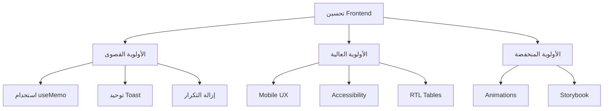

# تقرير مراجعة الواجهة الأمامية Frontend UI Audit

## الملخص التنفيذي

ركز هذا التقرير على مراجعة شاملة للواجهة الأمامية فقط، بما في ذلك التصميم، تجربة المستخدم، الأداء، وجودة الكود الأمامي.

---

## القسم الأول: تحليل نظام التصميم

### 1.1 نظام الألوان

#### التقييم: ⭐⭐⭐⭐ (4/5)

| العنصر | الحالة | التفاصيل |
|--------|--------|----------|
| Primary Color | ✅ ممتاز | Blue (#2563eb) - مريح للعين |
| Secondary Color | ✅ جيد | Orange (#f97316) - للتركيز |
| Accent Color | ✅ جيد | Green (#14b8a6) - للنجاح |
| Dark Mode | ✅ موجود | دعم كامل للوضع الداكن |
| Contrast | ⚠️需要注意 | بعض النصوص في Dark mode |

#### نقاط القوة:
- نظام ألوان HSL متسق
- تدرجات جمالية (gradients)
- ألوان داكنة مريحة للعين

#### نقاط الضعف:
- تباين الألوان في Dark Mode يحتاج تحسين
- استخدام Emoji مmixed مع Icons

### 1.2 الخطوط

#### التقييم: ⭐⭐⭐⭐⭐ (5/5)

- ✅ Cairo font ممتاز للعربية
- ✅ Inter كخط بديل
- ✅ حجم مناسب للعناوين والنصوص

### 1.3 المكونات البصرية

#### Table Component (EditableTable)
- ✅ دعم التحرير المباشر
- ✅ Keyboard navigation
- ✅ RTL support
- ⚠️ يحتاج تحسين RTL بالكامل

#### Cards
- ✅ تصميم موحد
- ✅ ظلال متناسقة
- ✅ hover effects

#### Forms
- ✅ استخدام Radix UI
- ✅ Validation مع Zod
- ⚠️ Mobile optimization needed

---

## القسم الثاني: تحليل تجربة المستخدم UX

### 2.1 سهولة التنقل

#### التقييم: ⭐⭐⭐⭐ (4/5)

| الميزة | الحالة |
|--------|--------|
| Sidebar | ✅ واضح ومنظم |
| Bottom Nav (Mobile) | ✅ موجود ومريح |
| Breadcrumbs | ✅ موجود |
| Keyboard Shortcuts | ✅ Ctrl+K للبحث |
| Quick Actions | ✅ Header shortcuts |

#### نقاط القوة:
- تنقل سريع بين الصفحات الرئيسية
- بحث شامل (Ctrl+K)
- اختصارات لوحة المفاتيح

#### نقاط الضعف:
- Bottom Nav لا يظهر في جميع الصفحات
- لا يوجد "Back" واضح
- التنقل في صفحات المعاملات معقد

### 2.2 تفاعل المستخدم

#### التقييم: ⭐⭐⭐⭐ (4/5)

| الميزة | الحالة |
|--------|--------|
| Loading States | ✅ Skeleton loaders |
| Error Handling | ✅ Error Boundaries |
| Empty States | ✅ Clear messages |
| Confirmations | ✅ Dialogs قبل الحذف |
| Animations | ✅ Framer Motion |

#### التوصيات:
1. إضافة Drag & Drop للجداول
2. إضافة Undo/Redo
3. تحسين Toast notifications
4. إضافة Tooltips أكثر

### 2.3 التوافق مع الأجهزة

#### التقييم: ⭐⭐⭐⭐ (4/5)

| الجهاز | الحالة |
|--------|--------|
| Desktop | ✅ ممتاز |
| Tablet | ✅ جيد |
| Mobile | ⚠️ يحتاج تحسين |

#### المشاكل على الجوال:
1. بعض الجداول غير قابلة للتمرير
2. ازرار صغيرة جداً
3. نصوص غير مقروءة بدون Zoom
4. keyboard ظاهرية تغطي المحتوى

---

## القسم الثالث: تحليل الأداء

### 3.1 التحسينات الحالية

#### التقييم: ⭐⭐⭐⭐ (4/5)

✅ **جيد**:
- Lazy Loading للصفحات
- Code Splitting
- Memoization (useMemo, useCallback)
- Tree Shaking لل Icons

### 3.2 مشاكل الأداء

#### ❌ مشاكل مكتشفة:

1. **NotificationBell**:
   ```typescript
   // المشكلة: recalculates على كل render
   const notifications = useAppStore(s => s.shipments); // بدون useMemo
   ```

2. **MobileContext**:
   ```typescript
   // المشكلة: recalculates على كل render
   const value = { isMobile, orientation, config }; // بدون useMemo
   ```

3. **Logo Image**:
   - حجم 69KB كبير جداً
   - يبطئ التحميل الأول

4. **Google Fonts**:
   - تحميل خارجي للخطوط
   -阻塞 التحميل

### 3.3 توصيات الأداء

#### الأولوية القصوى:

1. **إضافة useMemo لـ NotificationBell**:
```typescript
const notifications = useMemo(() => {
  return shipments.filter(s => s.status === 'in_transit');
}, [shipments]);
```

2. **تحسين MobileContext**:
```typescript
const value = useMemo(() => ({
  isMobile, orientation, config
}), [isMobile, orientation, config]);
```

3. **ضغط Logo**:
   - تحويل إلى WebP
   - ضغط إلى أقل من 20KB

4. **تحسين Font Loading**:
   - استخدام font-display: swap
   - إضافة preload

---

## القسم الرابع: جودة الكود الأمامي

### 4.1 الهيكل

#### التقييم: ⭐⭐⭐⭐ (4/5)

```
src/
├── components/
│   ├── layout/      ✅ جيد
│   ├── shared/      ✅ جيد
│   └── ui/         ✅ جيد
├── features/       ✅ ممتاز
├── hooks/         ⚠️ مكرر
├── lib/           ⚠️ مكرر
└── pages/         ✅ جيد
```

### 4.2Problems

#### ❌ التكرار (Duplication):

1. **ملفات Validation**:
   - `src/lib/validation.ts` 
   - `src/lib/validations.ts`
   - **الحل**: دمج في ملف واحد

2. **Hooks**:
   - `useScreenSize` مكرر
   - Mobile detection مكرر
   - **الحل**: توحيد في useCommonHooks

3. **Toast**:
   - Radix Toast
   - Sonner Toast
   - Custom hook
   - **الحل**: استخدام Sonner فقط

### 4.3 أفضل الممارسات

#### ✅ موجود:
- TypeScript مع strict
- Component composition
- Custom hooks
- Lazy loading

#### ❌ مفقود:
- Unit tests
- JSDoc comments
- Storybook
- Accessibility audit

---

## القسم الخامس: توصيات التحسين

### 5.1 المهام ذات الأولوية القصوى

| # | المهمة | الجهد | الأثر |
|---|--------|-------|-------|
| 1 | تحسين NotificationBell | صغير | عالي |
| 2 | توحيد Toast | صغير | متوسط |
| 3 | إزالة التكرار | متوسط | متوسط |
| 4 | ضغط Logo | صغير | متوسط |

### 5.2 المهام ذات الأولوية العالية

| # | المهمة | الجهد | الأثر |
|---|--------|-------|-------|
| 5 | تحسين Mobile UX | متوسط | عالي |
| 6 | إضافة Accessibility | متوسط | عالي |
| 7 | تحسين RTL Tables | متوسط | عالي |
| 8 | إضافة Tests | كبير | متوسط |

### 5.3 المهام ذات الأولوية المنخفضة

| # | المهمة | الجهد | الأثر |
|---|--------|-------|-------|
| 9 | إضافة Storybook | كبير | منخفض |
| 10 | تحسين Animations | متوسط | منخفض |
| 11 | إضافة Dark Mode toggle | صغير | متوسط |

---

## القسم السادس: خارطة طريق التحسين



---

## الخلاصة

التطبيق يتمتع بواجهة أمامية جيدة بشكل عام مع بعض Areas التي يمكن تحسينها. التركيز على الأداء (useMemo) وإزالة التكرار سيحسن جودة الكود بشكل كبير مع minimal effort.

**التقييم الإجمالي للـ Frontend**: ⭐⭐⭐⭐ (4/5)
