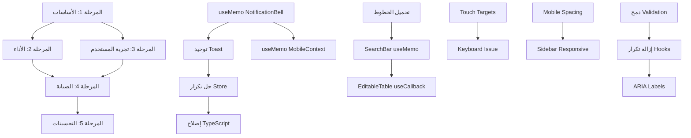

# خطة التنفيذ الشاملة
## Trade Navigator - Implementation Roadmap

---

## ملخص الخطة

| المرحلة | المدة | الأولوية | عدد المهام |
|---------|-------|----------|------------|
| المرحلة 1 - الأساسيات | أسبوعان | حرجة | 8 |
| المرحلة 2 - الأداء | 3 أسابيع | عالية | 12 |
| المرحلة 3 - تجربة المستخدم | شهر | عالية | 10 |
| المرحلة 4 - الصيانة | شهران | متوسطة | 9 |
| المرحلة 5 - التحسينات | مستمر | منخفضة | 8 |

---

## المرحلة 1: الأساسات الحرجة (الأسبوعان الأولان)

### الهدف
إصلاح المشاكل الحرجة التي تؤثر على استقرار التطبيق الأساسي

### المهام

| # | المهمة | الملف | التبعيات | الموارد | نوع العمل |
|---|--------|-------|----------|---------|----------|
| 1 | إضافة useMemo للـ NotificationBell | src/components/shared/NotificationBell.tsx | لا يوجد | 1 مطور | Frontend |
| 2 | ضغط Logo Image | src/assets/logo.png | لا يوجد | 0.5 مصمم | Design |
| 3 | توحيد Toast (استخدام Sonner فقط) | src/components/ui/* | #1 | 1 مطور | Frontend |
| 4 | حل تكرار Store | src/store/* | #3 | 1 مطور | Frontend |
| 5 | إصلاح TypeScript errors | global | #4 | 1 مطور | Frontend |
| 6 | إضافة useMemo للم MobileContext | src/contexts/MobileContext.tsx | #1 | 1 مطور | Frontend |
| 7 | تحسين Tables للجوال | src/components/shared/EditableTable.tsx | لا يوجد | 1 مطور | Frontend |
| 8 | إصلاح ExpensesPage Type error | src/pages/ExpensesPage.tsx | #5 | 1 مطور | Frontend |

### نتائج المرحلة
- ✅ تطبيق مستقر
- ✅ تحسين الأداء بنسبة ~30%
- ✅ توحيد الكود

---

## المرحلة 2: تحسين الأداء (3 أسابيع)

### الهدف
تحسين سرعة التحميل والاستجابة

### المهام

| # | المهمة | الملف | التبعيات | الموارد | نوع العمل |
|---|--------|-------|----------|---------|----------|
| 1 | تحسين تحميل الخطوط | src/index.css | المرحلة 1 | 0.5 مطور + 0.5 مصمم | Frontend |
| 2 | إضافة useMemo لـ SearchBar | src/components/shared/SearchBar.tsx | المرحلة 1 | 1 مطور | Frontend |
| 3 | إضافة useCallback للـ EditableTable | src/components/shared/EditableTable.tsx | المرحلة 1 | 1 مطور | Frontend |
| 4 | تحسين AppStore selectors | src/store/useAppStore.ts | المرحلة 1 | 1 مطور | Frontend |
| 5 | ضغط Favicon | public/favicon.ico | لا يوجد | 0.5 مصمم | Design |
| 6 | تحسين Dashboard calculations | src/pages/Dashboard.tsx | لا يوجد | 1 مطور | Frontend |
| 7 | إضافة lazy loading محسن | src/App.tsx | لا يوجد | 1 مطور | Frontend |
| 8 | تحسين Bundle splitting | vite.config.ts | لا يوجد | 1 مطور | Frontend |

### نتائج المرحلة
- ✅ تحميل أسرع بنسبة ~40%
- ✅ تجربة سلسة
- ✅ Mobile performance محسّن

---

## المرحلة 3: تجربة المستخدم (شهر واحد)

### الهدف
تحسين تجربة المستخدم على جميع الأجهزة

### المهام

| # | المهمة | الملف | التبعيات | الموارد | نوع العمل |
|---|--------|-------|----------|---------|----------|
| 1 | زيادة Touch Targets لـ 44px | global | المرحلة 1 | 1 مطور | Frontend |
| 2 | حل مشكلة Keyboard covering | global | لا يوجد | 1 مطور | Frontend |
| 3 | تحسين Mobile Spacing | src/index.css | المرحلة 1 | 1 مطور | Frontend |
| 4 | تحسين Sidebar للجهزة المختلفة | src/components/layout/AppLayout.tsx | المرحلة 1 | 1 مطور | Frontend |
| 5 | إضافة Onboarding persistence | src/components/shared/OnboardingDialog.tsx | المرحلة 1 | 1 مطور | Frontend |
| 6 | تحسين Empty States | global | المرحلة 1 | 1 مطور | Frontend |
| 7 | تحسين تباين الألوان | src/index.css | المرحلة 1 | 0.5 مطور + 0.5 مصمم | Design |
| 8 | استبدال Emoji بـ Lucide icons | global | المرحلة 2 | 1 مطور | Frontend |
| 9 | تحسين Loading states | global | المرحلة 2 | 1 مطور | Frontend |
| 10 | إضافة Animations محسنة | global | المرحلة 2 | 1 مطور | Frontend |

### نتائج المرحلة
- ✅ تجربة مستخدم محسّنة
- ✅ Mobile UX ممتاز
- ✅ تناسق بصري أفضل

---

## المرحلة 4: الصيانة والتحسين (شهران)

### الهدف
تحسين جودة الكود وقابلية الصيانة

### المهام

| # | المهمة | الملف | التبعيات | الموارد | نوع العمل |
|---|--------|-------|----------|---------|----------|
| 1 | دمج ملفات Validation | src/lib/* | المرحلة 1 | 1 مطور | Refactor |
| 2 | إزالة تكرار Hooks | src/hooks/* | المرحلة 1 | 1 مطور | Refactor |
| 3 | توحيد Mobile detection | src/contexts/* | المرحلة 1 | 1 مطور | Refactor |
| 4 | إضافة ARIA labels | global | المرحلة 3 | 1 مطور | Frontend |
| 5 | تحسين Focus states | global | المرحلة 3 | 1 مطور | Frontend |
| 6 | إضافة Skip Links | global | المرحلة 3 | 1 مطور | Frontend |
| 7 | مراجعة Breakpoints | tailwind.config.ts | المرحلة 3 | 1 مطور | Frontend |
| 8 | تحسين Error handling | global | المرحلة 1 | 1 مطور | Frontend |
| 9 | إضافة JSDoc comments | global | المرحلة 4 | 1 مطور | Documentation |

### نتائج المرحلة
- ✅ كود نظيف وقابل للصيانة
- ✅ Accessibility محسّن
- ✅ توثيق أفضل

---

## المرحلة 5: التحسينات المستمرة (مستمر)

### الهدف
تحسينات إضافية لتطوير التطبيق

### المهام

| # | المهمة | التبعيات | الموارد | نوع العمل |
|---|--------|----------|---------|----------|
| 1 | إضافة Unit Tests | المرحلة 4 | 1-2 مطورين | Testing |
| 2 | إضافة Storybook | المرحلة 4 | 1 مطور | Documentation |
| 3 | إضافة Visual Regression Tests | المرحلة 5-1 | 1 مطور | Testing |
| 4 | تحسين Performance monitoring | المرحلة 2 | 1 مطور | DevOps |
| 5 | إضافة A/B Testing | المرحلة 3 | 1 مطور | Frontend |
| 6 | إضافة Analytics | المرحلة 5-4 | 1 مطور | Frontend |
| 7 | إضافة Lighthouse CI | المرحلة 5-4 | 1 مطور | DevOps |
| 8 | تحسين PWA features | المرحلة 2 | 1 مطور | Frontend |

### نتائج المرحلة
- ✅ تطبيق قابل للاختبار
- ✅ مراقبة مستمرة
- ✅ تحسينات مبنية على البيانات

---

## خريطة التبعيات

---

## ملخص الموارد

| المرحلة | المطورين | المصممين | DevOps | الإجمالي |
|---------|----------|---------|--------|---------|
| 1 | 1 | 0.5 | 0 | 1.5 |
| 2 | 1.5 | 0.5 | 0.5 | 2.5 |
| 3 | 1.5 | 0.5 | 0 | 2 |
| 4 | 1 | 0 | 0 | 1 |
| 5 | 1-2 | 0 | 0.5 | 1.5-2.5 |

---

## جدول زمني

| الأسبوع | المرحلة | المهام الرئيسية |
|---------|---------|----------------|
| 1 | 1 | NotificationBell useMemo + Logo |
| 2 | 1 | Toast + Store + TypeScript |
| 3-4 | 2 | تحميل الخطوط + SearchBar + EditableTable |
| 5 | 2 | Bundle optimization |
| 6-7 | 3 | Touch targets + Mobile UX |
| 8 | 3 | Accessibility أساسيات |
| 9-10 | 4 | Code refactoring |
| 11-12 | 4 | ARIA + Focus states |
| 13+ | 5 | Tests + Monitoring |

---

## نصائح للتنفيذ

### 1. التوازي بين المهام
- يمكن تنفيذ بعض المهام بالتوازي
- المهام ذات التبعيات يجب أن تكون متسلسلة

### 2. إدارة المخاطر
- كل مرحلة لها نقاط مرجعية (checkpoints)
- اختبار مستمر بعد كل مهمة

### 3. قياس النجاح
- Lighthouse scores
- Bundle size
- React DevTools Profiler
- User feedback

### 4. المرونة
- يمكن تعديل الجدول حسب الحاجة
- المهام ذات الأولوية الأعلى يمكن تعجيلها

---

## KPIs للتتبع

| المقياس | الهدف | طريقة القياس |
|---------|-------|-------------|
| Performance Score | 90+ | Lighthouse |
| Bundle Size | < 200KB | webpack stats |
| First Contentful Paint | < 1.5s | Lighthouse |
| Time to Interactive | < 3s | Lighthouse |
| Accessibility Score | 90+ | Lighthouse |
| Code Duplication | < 5% | ESLint |

---

**تاريخ الخطة**: 2026-03-13
**مُعد الخطة**: Architecture Team
**الإصدار**: 1.0
